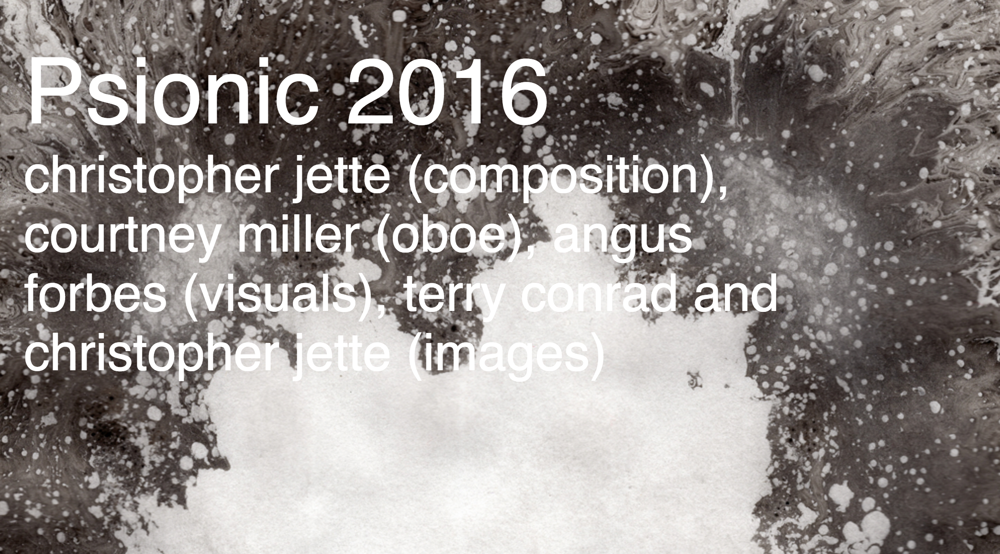
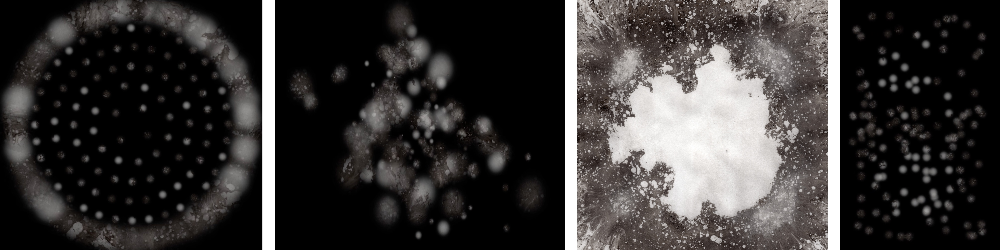

# Psionic
Animation for Christopher Jette's composition "Psionic"

Instructions: download the project and open psionic.html in a browser (requires a webserver).

Or click here to play Psionic in your browser (tested on Chrome): <a href="http://creativecoding.evl.uic.edu/Psionic/psionic.html">
http://creativecoding.evl.uic.edu/Psionic/psionic.html</a>. Press 'a' to start the animation.

You can aslo download a 350MB video of the visuals from: <a href="http://creativecoding.evl.uic.edu/Psionic/psionic.mov">
http://creativecoding.evl.uic.edu/Psionic/psionic.mov</a>.

A recording of the performance with Courtney Miller on oboe will be posted soon.

